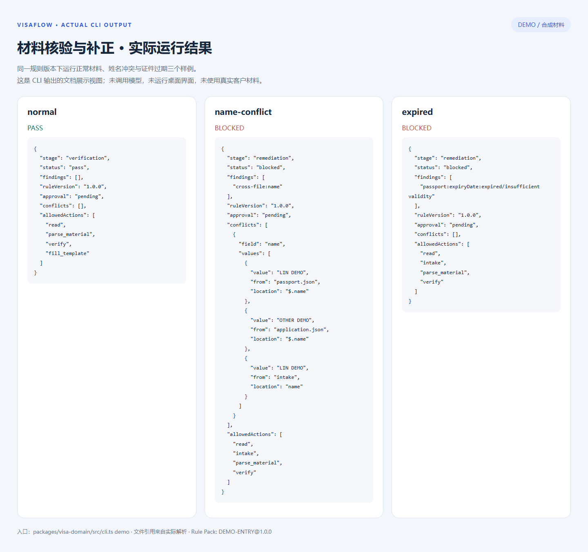
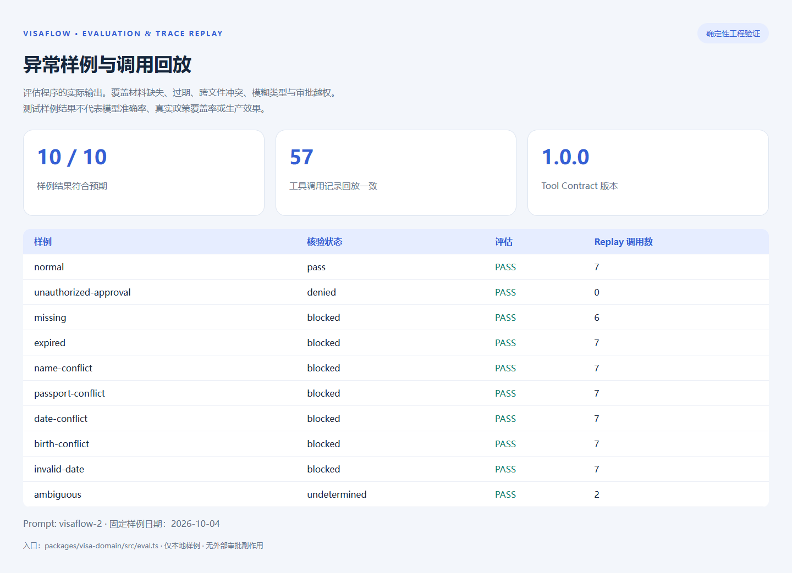
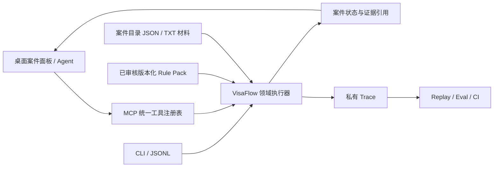

# VisaFlow

**签证材料预审与流程编排 Agent** · 版本化规则 · 五阶段 Workflow · MCP / CLI · Trace Replay

[](https://github.com/siye566/visaflow/actions/workflows/visaflow.yml)
[](LICENSE)
[](packages/visa-domain)

VisaFlow 将客户信息、材料要求与核验过程组织为可追踪的案件流程。Agent 调用领域工具采集信息、匹配类型、生成清单、检查材料并驱动补正；确定性执行器检查阶段许可、版本、文件证据和人工确认条件，帮助避免跳步骤和无依据结论。

公开版本使用合成材料与虚构目的地 DEMO。默认 Rule Pack 是工程样例；实际使用需要经人工核验的规则包。项目提供材料预审，签证签发由有权机关决定。

## 运行展示

以下为**实际 CLI 输出整理成的文档视图**，使用合成样例，未调用模型。桌面案件面板已有实现，截图展示的是领域模块运行结果。





## 核心实现

| 能力 | 实现与证据 |
| --- | --- |
| 版本化 Rule Pack | 类型条件、材料字段、有效期、适用范围、来源、生效日期、SOP、模板与错误案例；案件固定完整规则哈希 |
| 五阶段 Workflow | 采集 → 类型判断 → 清单 → 核验 → 补正；动态返回当前 allowedActions，执行器拒绝越阶段调用；按类型裁剪材料 kind |
| MCP 材料工具 | 统一注册的 visa_case_read / visa_workflow；读取信息、规则检索、JSON/TXT 解析、清单、日期与跨文件核验、文本模板填充 |
| 人工确认门禁 | 类型确认与材料预审审批由本地人工 CLI 执行，MCP Agent 无权替代；补传材料使旧核验/审批失效 |
| CLI / 批量回放 | 单次 JSON 请求、JSONL 批量调用，保存参数、证据、规则与审批状态，内存 Trace Replay 检查版本和结果漂移 |
| Eval / CI | 正常、缺失、过期、姓名/证件号/出生日期/出行日期冲突、非法日期、模糊类型与越权样例 |

这里的动态裁剪是**领域动作与材料输入的运行时门禁**，提供商 MCP tool-list 仍使用稳定 schema。通用文件/执行工具不属于领域沙箱。完整模型上下文暂未自动捕获，modelInput 为调用者传入的真实内容或 null。

## 快速运行

需要 **Node.js 22.18+**；领域演示无需 API Key、数据库或桌面构建。

```sh
git clone https://github.com/siye566/visaflow.git
cd visaflow
node --experimental-strip-types packages/visa-domain/src/cli.ts demo
node --experimental-strip-types packages/visa-domain/src/cli.ts demo name-conflict
node --experimental-strip-types packages/visa-domain/src/cli.ts demo expired
```

每次 demo 使用隔离临时目录，输出 caseDirectory 与实际核验结果。正常材料返回 pass；冲突与过期样例返回 blocked 并进入 remediation，保留问题字段、文件位置及规则引用。

```sh
# 当前案件信息
node --experimental-strip-types packages/visa-domain/src/cli.ts call <case-dir> <request.json>
# JSONL 批量调用
node --experimental-strip-types packages/visa-domain/src/cli.ts batch <case-dir> <requests.jsonl>
# 无外部副作用的调用回放
node --experimental-strip-types packages/visa-domain/src/cli.ts replay <case-dir>
```

实际动作与人工确认请求见 [Workflow / MCP / CLI 文档](docs/workflow-and-tools.md)。

## 架构与源码



| 入口 | 内容 |
| --- | --- |
| [packages/visa-domain/src](packages/visa-domain/src) | Rule Pack、阶段门禁、字段核验、持久化、CLI、Eval |
| [visa-workflow.ts](packages/session-tools-core/src/handlers/visa-workflow.ts) | 宿主 sessionPath 与固定 agent 身份适配 |
| [visa-search-rules.ts](packages/session-tools-core/src/handlers/visa-search-rules.ts) | 原有关键词规则检索与来源引用 |
| [tool-defs.ts](packages/session-tools-core/src/tool-defs.ts) | MCP / Claude / Pi 共用工具注册与 schema |
| [system.ts](packages/shared/src/prompts/system.ts) | VisaFlow preset 阶段提示词与工具约束 |
| [桌面案件组件](apps/electron/src/renderer/components/visaflow) | 读取 visaflow-case.json，展示清单、材料与冲突 |

领域模块独立运行；桌面模块沿用仓库原有 Bun/Agent 运行时，需要完整依赖和模型配置。案件 JSON 保持已有面板字段兼容。本次未验证完整 Electron 打包或真实模型端到端会话。

## 验证

```sh
cd packages/visa-domain
npm ci --ignore-scripts --workspaces=false
npm run typecheck
npm test
npm run eval
```

当前本地结果：**23 项领域/适配器/CLI 测试通过，10/10 合成评估样例符合预期，57 条调用记录回放一致**。另有 22 项工具注册、检索及相关回归测试通过，CI 会在 Rule Pack、Prompt 或工具修改后重跑。[可复现评估报告](docs/evaluation-report.json) · [GitHub Actions](https://github.com/siye566/visaflow/actions/workflows/visaflow.yml)。

这些数字衡量确定性实现与工程门禁，不代表 LLM 准确率、真实材料覆盖率或生产性能。公开样例日期固定为 2026-10-04。修改版本常量后旧 Trace 会报告 drift，需重新评估。

## 当前边界

- 支持扁平字段 JSON 与 key:value TXT；PDF / OCR / 扫描件解析尚未接入。
- 关键词检索已实现；向量检索不在当前版本中。原有检索语料未进行现行政策时效性核验。
- 人工角色是本机 CLI 操作员声明；远程身份认证与多用户权限服务尚未实现。
- 默认规则仅用于虚构目的地 DEMO；真实国家返回类型未确定，不使用样例规则给出真实结论。
- 材料、证件信息、私有 Trace 与凭证不应上传。仓库忽略案件/规则配置与追踪输出，公开展示仅使用合成数据。

[规则结构与 SOP](docs/rule-pack.md) · [工具、回放与接入文档](docs/workflow-and-tools.md)

## 许可

Apache-2.0。项目保留运行时及相关依赖的 [LICENSE](LICENSE)、[NOTICE](NOTICE) 与法定署名信息。
